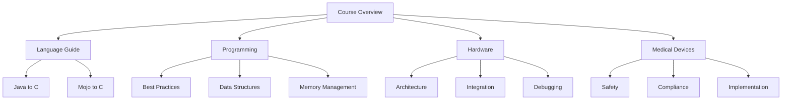

# CIS 240: Computer Architecture and Low-Level Programming

## Course Documentation Index

## Quick Links

### 1. [Course Overview](sections/01_overview.md)
- Course introduction
- Prerequisites
- Learning objectives
- Contact information

### 2. [Language Transition](sections/02_language_transition.md)
- Moving from Java to C
- Transitioning from Mojo to C
- Key differences
- Common pitfalls

### 3. [Programming Gotchas and Best Practices](sections/03_gotchas_and_practices.md)
- Memory management issues
- Buffer overflows
- Pointer arithmetic
- Best practices
- Error handling

### 4. [Data Type Conversions](sections/04_type_conversions.md)
- String and number conversions
- Base conversions
- Data structure transformations
- Type safety guidelines

### 5. [Practical Examples](sections/05_practical_examples.md)
- Data structure implementations
- Event systems
- Memory pools
- Practice projects
- Testing strategies

### 6. [Hardware Integration](sections/06_hardware_integration.md)
- Memory hierarchy
- CPU architecture
- Memory mapping
- Interrupt handling
- DMA operations
- GPIO control

### 7. [Medical Device Integration](sections/07_medical_devices.md)
- Safety-critical programming
- Sensor data processing
- Device communication
- Power management
- Regulatory compliance

## Study Path Recommendations

### Beginner Path
1. Start with Course Overview
2. Move to Language Transition
3. Study Programming Gotchas
4. Practice with Type Conversions
5. Work through Practical Examples

### Advanced Path
1. Review Hardware Integration
2. Deep dive into Medical Devices
3. Focus on Safety-Critical Programming
4. Explore Advanced Optimizations
5. Study Regulatory Compliance

## Additional Resources

### Tools and Software
- GCC/Clang Compiler
- Debugging Tools (GDB, Valgrind)
- Hardware Simulators
- Development Environments

### Reference Materials
- C Language Specification
- Hardware Datasheets
- FDA Guidelines
- Safety Standards

### Practice Materials
- Coding Exercises
- Hardware Projects
- Medical Device Case Studies
- Safety Analysis Examples

## Getting Help
- Office Hours Schedule
- Discussion Forums
- Lab Assistant Contacts
- Emergency Resources

## Contributing
Want to improve this documentation? Here's how:
1. Submit issues for errors or unclear content
2. Propose improvements via pull requests
3. Share additional examples and case studies
4. Contribute to the practice materials 